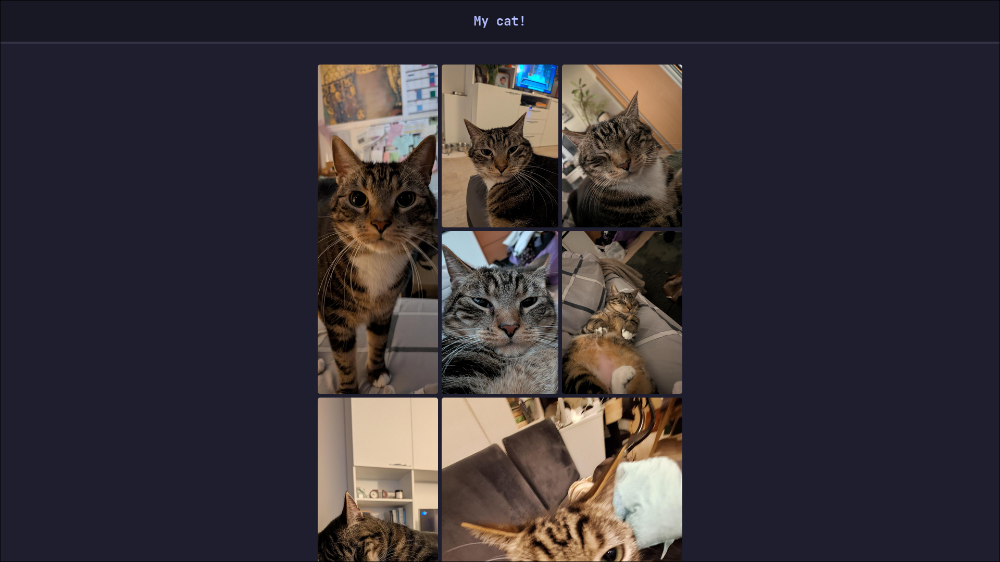
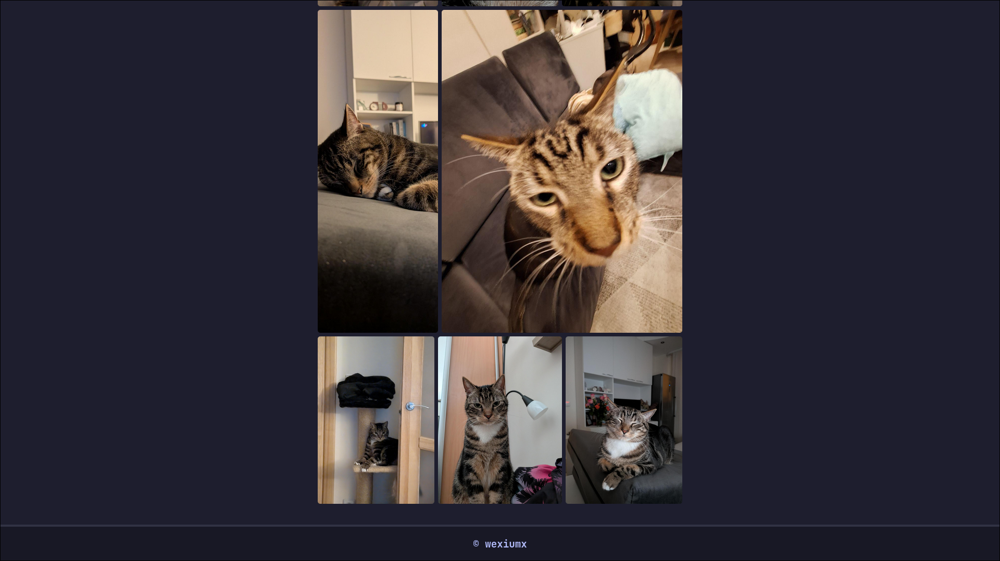

# My Cat Gallery

A simple photo gallery showcasing my cat. Built to practice CSS Grid layout.

## Screenshots

Click to view website screenshot

## Features

- Responsive grid layout
- Clean, minimal design
- Dark theme

## Tech

- HTML
- CSS (Grid)

## What I Learned

This project helped me understand CSS Grid fundamentals - creating a responsive image gallery with automatic placement and proper spacing.

## Running

Just open `index.html` in your browser.
